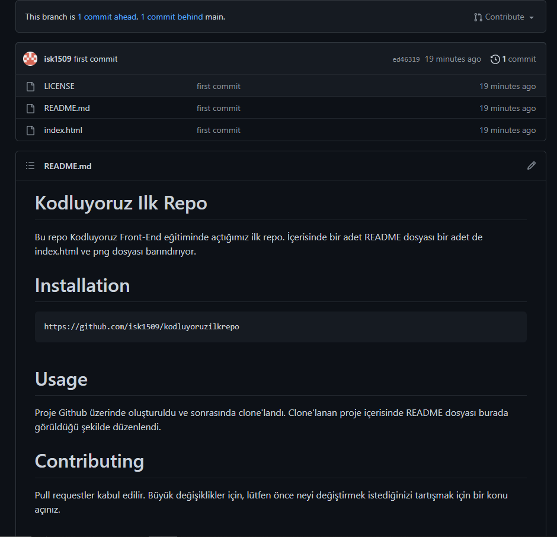

# Kodluyoruz Ilk Repo
Bu repo Kodluyoruz Front-End eğitiminde açtığımız ilk repo. İçerisinde bir adet README dosyası bir adet de index.html ve png dosyası barındırıyor.


# Installation 

```
https://github.com/isk1509/kodluyoruzilkrepo
```



# Usage
Proje Github üzerinde oluşturuldu ve sonrasında clone'landı. Clone'lanan proje içerisinde README dosyası burada görüldüğü şekilde düzenlendi.


# Contributing

Pull requestler kabul edilir. Büyük değişiklikler için, lütfen önce neyi değiştirmek istediğinizi tartışmak için bir konu açınız.

# License


[MIT](https://choosealicense.com/licenses/mit/)


